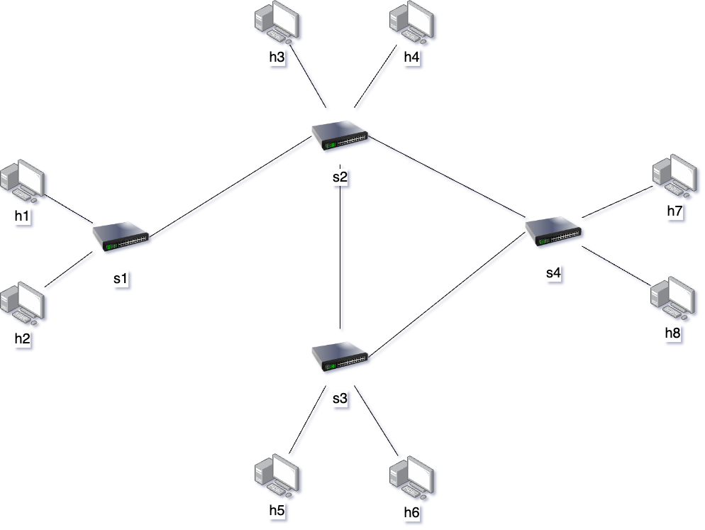
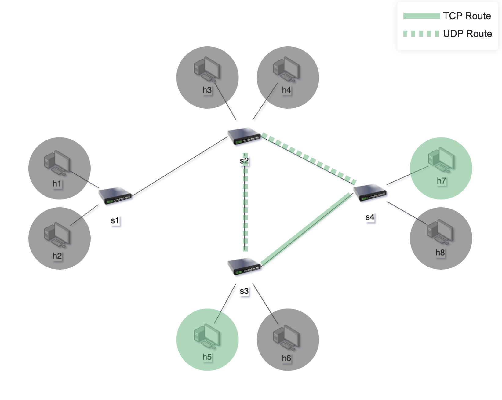

# On Demand SDN Slices in ComNetsEmu

This project focuses on implementing a network slicing approach within ComNetsEmu, allowing for the dynamic activation and deactivation of network slices.

## Table of Contents
- [Goal](#goal)
- [Implementation Overview](#implementation-overview)
- [Getting Started](#getting-started)
- [Contributors](#contributors)

## Goal

The primary objective of this project is to facilitate the dynamic management of network slices within a Software-Defined Networking (SDN) environment. This entails enabling users to activate and deactivate different slices on-demand, providing flexibility and adaptability to changing network requirements.

## Implementation Overview

- **SDN Controller**: The project utilizes a single RYU SDN controller to manage the network slicing functionality.
- **Network Topology**: The network comprises 8 hosts and 4 switches.

- **Slices Description**: The network is divided into three distinct slices:
  1. **Production Slice**: Includes hosts h2, h3, h4, and h8. These hosts are part of the production environment and have bandwidth allocation of 500Mbps.
     

  2. **Management Slice**: Consists of hosts h5 and h7. This slice is dedicated to management tasks and employs different routing paths and bandwidth allocation for UDP and TCP traffic. 300Mbps for TCP traffic and 400Mbps for UDP traffic.

  3. **Development Slice**: Comprises hosts h1 and h6, designated for development purposes.

## Getting Started

To get started with the project, follow these steps:
1. Run the Comnetsemu VM. For detailed instructions, refer to [Comnetsemu Setup Instructions](https://www.granelli-lab.org/researches/relevant-projects/comnetsemu-labs). 
2. 

## Networking 2 - Softwarized and Virtualized Mobile Networks course project, prof. Fabrizio Granelli

### Università degli studi di Trento 
