# On Demand SDN Slices in ComNetsEmu

### Networking 2 - Softwarized and Virtualized Mobile Networks course project, prof. Fabrizio Granelli

### Università degli studi di Trento 

## Contributors

| Name                 | Email                                  |
|----------------------|----------------------------------------|
| Alessandro Migotto   | alessandro.migotto@studenti.unitn.it   |
| Elif Ruveyha Ozmen   | elifruveyha.ozmen@studenti.unitn.it    |


This project focuses on implementing a network slicing approach within ComNetsEmu, allowing for the dynamic activation and deactivation of network slices.

## Table of Contents
- [Goal](#goal)
- [Implementation Overview](#implementation-overview)
- [Getting Started](#getting-started)
- [Test Results](#test-results)
- [Contributors](#contributors)

## Goal

The primary objective of this project is to facilitate the dynamic management of network slices within a Software-Defined Networking (SDN) environment. This entails enabling users to activate and deactivate different slices on-demand, providing flexibility and adaptability to changing network requirements.

## Implementation Overview

- **SDN Controller**: The project utilizes a single RYU SDN controller to manage the network slicing functionality.
- **Network Topology**: The network comprises 8 hosts and 4 switches.

<div align=center>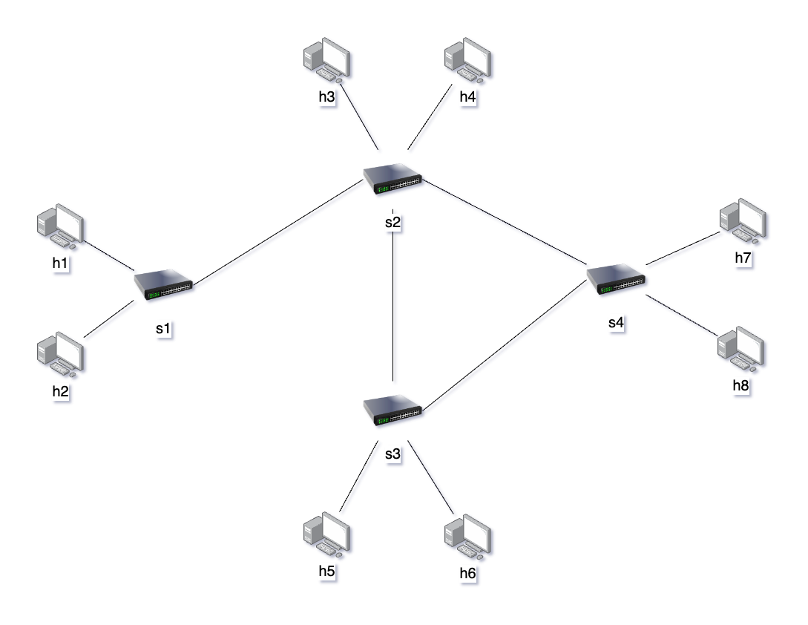</div>

Initially, there is no connection between any hosts. Below is the image with the `pingall` command ran, showing that there is no connection between hosts.

<div align=center>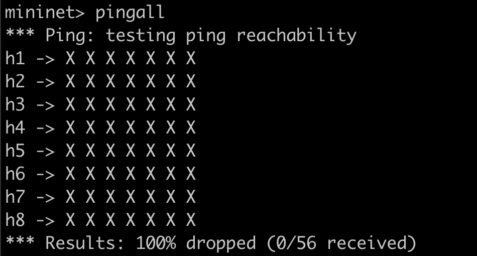</div>


The network is divided into three distinct slices:

  ### 1. Production Slice
  Includes hosts h1, h2, h3, h4, and h8. These hosts are part of the production environment and have bandwidth allocation of 500Mbps.
     
<div align=center>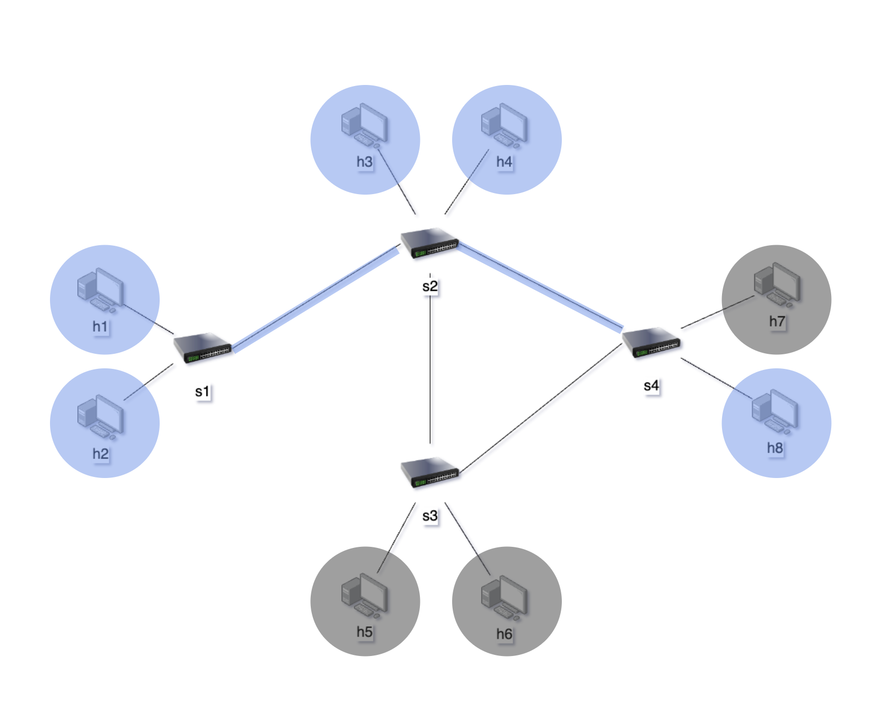</div>

  ### 2. Management Slice
  Consists of hosts h5 and h7. This slice is dedicated to management tasks and employs different routing paths and bandwidth allocation for UDP and TCP traffic. 300Mbps for TCP traffic and 400Mbps for UDP traffic.

<div align=center>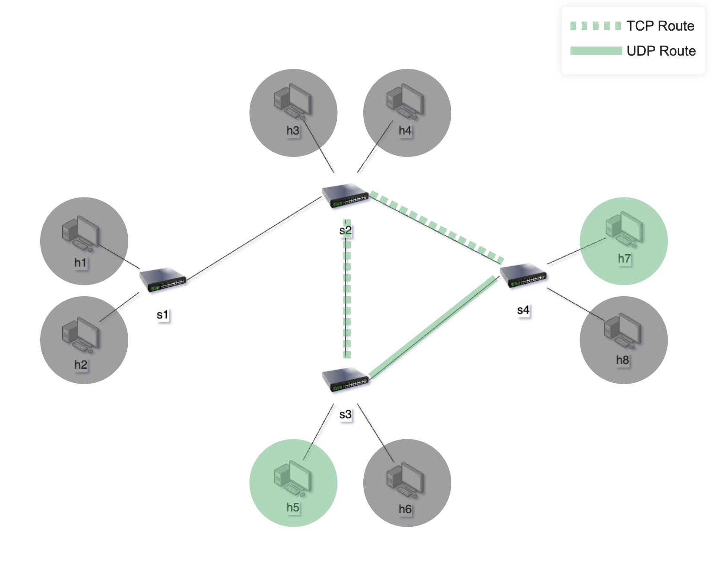</div>

  ### 3. Development Slice
  Comprises hosts h1 and h6, designated for development purposes.

<div align=center></div>

## Getting Started

To get started with the project, follow these steps:

1. Run the ComNetsEmu VM. For detailed instructions, refer to [ComNetsEmu Setup Instructions](https://www.granelli-lab.org/researches/relevant-projects/comnetsemu-labs). 
2. Clone this repository to your ComNetsEmu virtual machine
3. Open a terminal and navigate to the cloned repository directory
4. Ensure that Flask is installed. You can install Flask using pip install if it is not already installed:

    ```
    pip install flask
    ```

5. Run the Ryu manager along with the interface:

    ```
    ryu-manager slicing.py
    ```

6. Open another terminal window and navigate to the same directory
7. Start Mininet with the provided network configuration:

    ```
    sudo python3 network.py
    ```
    This command will set up the network according to the specified topology and slices.

8. You can now use the interface to activate or deactivate network slices as needed.
9. Additionally, you can perform tests using the Mininet terminal to verify the behavior of the network under different conditions.


## Test Results

### Production Slice

The image below shows the `pingall` command results for the Production Slice, indicating active connections among these hosts.

<div align=center>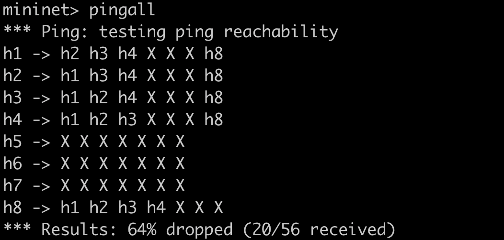</div>

The image below shows the TCP bandwidth test results for the Production Slice between h1, h2, h3, h4, and h8 using `iperf` command.

<div align=center>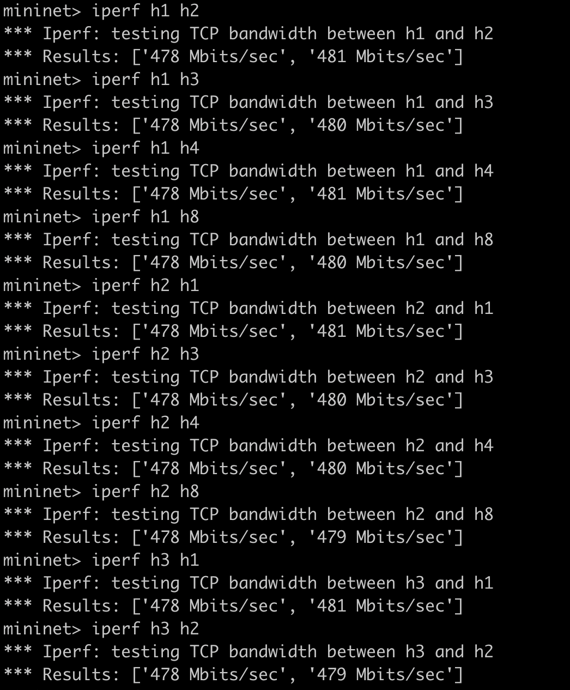</div>

<div align=center>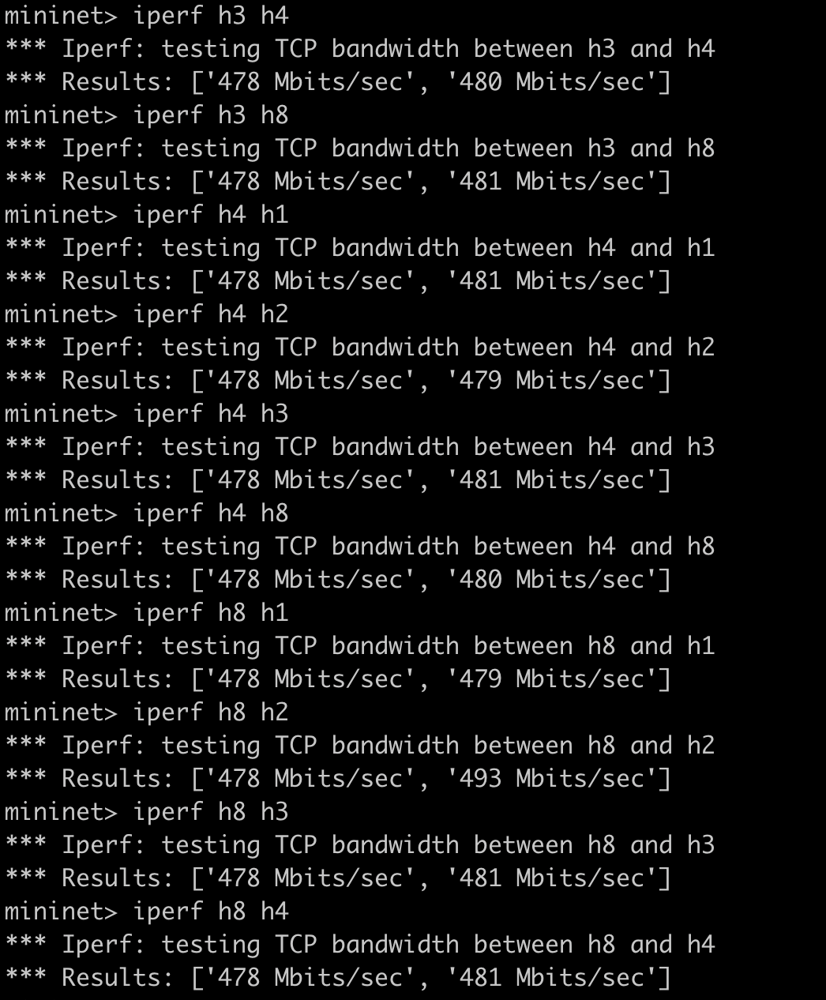</div>

### Management Slice

 The `pingall` command results for the Management Slice are shown in the image below.

<div align=center>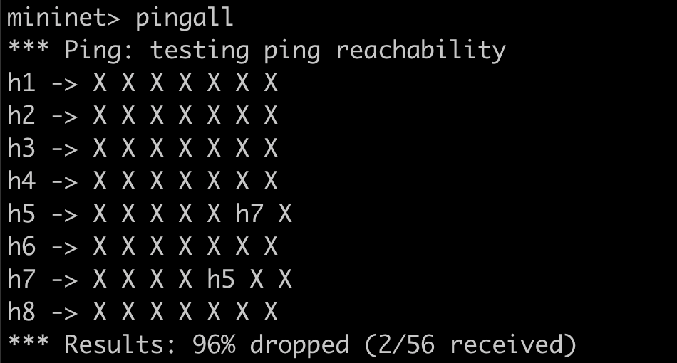</div>

The `iperf` command results for the TCP bandwidth test results between h5 and h7 is in the image below.

<div align=center>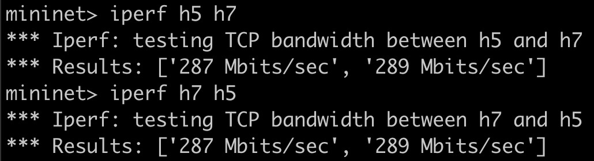</div>

The `iperf` command results for the UDP bandwidth test results for 10 seconds between h5 as in server mode and h7 as in client mode is in the image below.

Server h5:
<div align=center>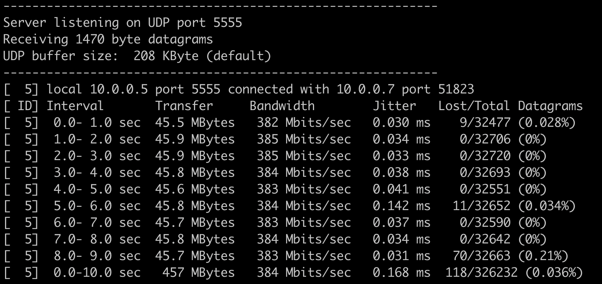</div>
Client h7
<div align=center>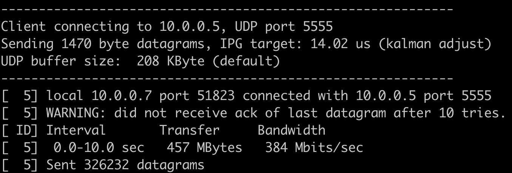</div>

### Development Slice


The image below shows the `pingall` command results for the Development Slice.

<div align=center>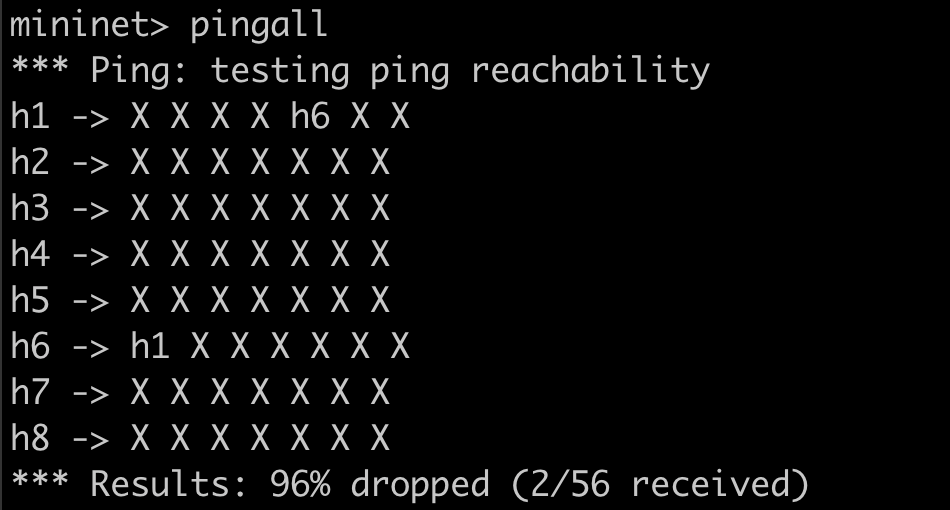</div>

Below is an image showing the results of the TCP bandwidth test using the `iperf` command between h1 and h6.

<div align=center>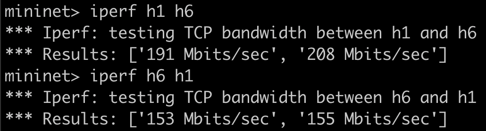</div>

